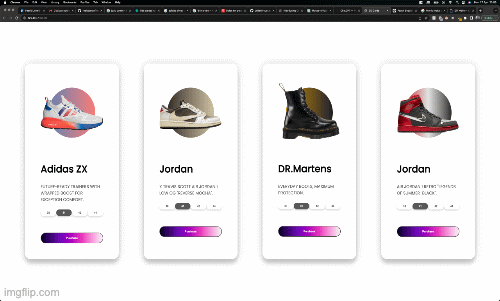

# Animated-3D-Card

A simple animated 3D Card in vanilla JavaScript displaying mutilple cards.

Thanks to [Dev Ed](https://github.com/developedbyed) for the awesome [tutorial](https://www.youtube.com/watch?v=XK7T3mY1V-w).

Example of a single card :

  

